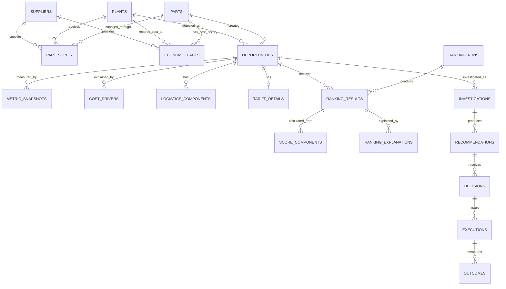

# CAT Cost Intelligence Data Model

This document describes the current PostgreSQL data model and the recommended analytical model for opportunity scoring.

## 1. Business purpose

The system finds procurement cost-saving opportunities, ranks them, sends selected opportunities through investigation and approval, and records the final result.

The main business path is:

```text
Part + Plant + Supplier cost history
                ↓
          Opportunity
                ↓
       Ranking and explanation
                ↓
          Investigation
                ↓
          Recommendation
                ↓
            Decision
                ↓
           Execution
                ↓
             Outcome
```

## 2. Database schemas

| Schema | Purpose |
|---|---|
| `catalog` | Parts, specifications, attributes, and equipment compatibility |
| `supply` | Plants, suppliers, and part-supplier relationships |
| `economics` | Historical purchase cost and volume facts |
| `opportunity` | Detected opportunities and their analytical evidence |
| `recsys` | Ranking runs, scores, score components, and explanations |
| `workflow` | Investigation, recommendation, decision, execution, and outcome records |
| `identity_data` | Users, roles, and expert profiles |
| `telemetry` | API and AI-assistant activity |

## 3. Core relationships



The diagram uses short entity names. Their physical PostgreSQL tables are listed below.

## 4. Important operational tables

### Master data

| Table | Grain | Important columns |
|---|---|---|
| `catalog.parts` | One row per part | `id`, `part_number`, `category`, `part_family`, `part_type` |
| `supply.plants` | One row per plant | `id`, `plant_code`, `country`, `region`, `currency` |
| `supply.suppliers` | One row per supplier | `id`, `country`, quality, delivery, responsiveness, and overall scores |
| `supply.part_supply` | One part-plant-supplier relationship | Supplier share, primary-supplier flag, effective dates |

### Cost history

`economics.part_economic_fact` has one row per part, plant, supplier, and month.

It contains:

- unit cost and base price;
- ocean freight and local transport;
- import duty;
- insurance, packaging, and handling;
- purchase volume and total spend;
- source currency and source system.

This is the main raw fact table for creating historical cost features.

### Opportunity evidence

| Table | Purpose |
|---|---|
| `opportunity.opportunities` | One detected opportunity for a part at a plant |
| `opportunity.metric_snapshots` | Monthly opportunity metrics and benchmark comparison |
| `opportunity.cost_drivers` | Ranked reasons for the cost difference |
| `opportunity.plant_comparisons` | Cost comparison against other plants |
| `opportunity.supplier_comparisons` | Cost comparison against suppliers |
| `opportunity.logistics_components` | Freight, duty, transport, and other landed-cost components |
| `opportunity.tariff_details` | Import-duty details and annual duty impact |
| `opportunity.opportunity_events` | Immutable business workflow events |

There are 12 `metric_snapshots` for each opportunity in the supplied synthetic dataset. A scoring record must therefore select the correct snapshot instead of joining all snapshots.

### Ranking data

| Table | Purpose |
|---|---|
| `recsys.ranking_runs` | Identifies one scoring run and its model version |
| `recsys.ranking_results` | Stores score and rank for each opportunity |
| `recsys.ranking_score_components` | Stores raw value, normalized value, weight, and contribution |
| `recsys.recommendation_explanations` | Stores readable reasons for a rank |

The supplied seed ranking is synthetic and was generated by a fixed formula. It is not a real outcome label.

### Workflow outcomes

| Table | Purpose |
|---|---|
| `workflow.investigations` | Assigned investigation and progress |
| `workflow.findings` | Evidence collected during investigation |
| `workflow.recommendations` | Proposed action and estimated savings |
| `workflow.decisions` | Approval or rejection decision |
| `workflow.executions` | Implementation progress and savings values |
| `workflow.outcomes` | Final cost, realized savings, realization percentage, and success |

`workflow.outcomes` contains the best targets for a future supervised ML model. The current seed has only three synthetic outcomes, which is not enough for reliable training.

## 5. Recommended ML training model

### Training grain

Use one row per:

```text
opportunity_id + scoring_timestamp
```

All features must contain only information available at or before `scoring_timestamp`. This is called point-in-time correctness.

Do not create one training row from every monthly snapshot unless the label and observation date are also defined for each month. Otherwise, the same opportunity will be duplicated and information can leak between training and test data.

### Candidate feature table

A future materialized table or feature view could be named:

```text
ml.opportunity_features
```

Recommended columns:

| Column | Type | Source | Description |
|---|---|---|---|
| `opportunity_id` | text | `opportunity.opportunities` | Stable entity key |
| `scoring_timestamp` | timestamp | scoring process | Time when features were valid |
| `part_category` | category | `catalog.parts` | Part category |
| `part_family` | category | `catalog.parts` | Part family |
| `plant_country` | category | `supply.plants` | Plant country |
| `plant_region` | category | `supply.plants` | Plant region |
| `unit_cost` | numeric | metric snapshot | Current unit cost |
| `peer_average_cost` | numeric | metric snapshot | Comparable peer cost |
| `cost_variance_percent` | numeric | metric snapshot | Difference from peer benchmark |
| `annual_volume` | numeric | metric snapshot | Expected annual quantity |
| `annual_spend` | numeric | metric snapshot | Expected annual spend |
| `potential_savings` | numeric | metric snapshot | Estimated savings before execution |
| `impact_score` | numeric | metric snapshot | Business impact measure |
| `data_confidence` | numeric | metric snapshot | Reliability of source evidence |
| `logistics_variance_percent` | numeric | logistics components | Logistics difference from peers |
| `tariff_variance_percent` | numeric | tariff details | Duty difference from peers |
| `supplier_quality_score` | numeric | supplier history | Historical supplier quality |
| `supplier_delivery_score` | numeric | supplier history | Historical supplier delivery |
| `unit_cost_change_3m` | numeric | economic facts | Recent cost movement |
| `unit_cost_volatility_12m` | numeric | economic facts | Stability of historical price |
| `purchase_volume_change_3m` | numeric | economic facts | Recent demand movement |
| `supplier_count` | integer | part supply | Number of available suppliers |

Identifiers such as part, plant, and supplier IDs may be retained for joins, but they should not automatically be used as model features.

### Label table

A future label table could be named:

```text
ml.opportunity_labels
```

Recommended columns:

| Column | Type | Meaning |
|---|---|---|
| `opportunity_id` | text | Links the result to its opportunity |
| `outcome_timestamp` | timestamp | Time when the outcome became known |
| `success` | boolean | Whether the action achieved the defined business goal |
| `expected_savings` | numeric | Approved expected savings |
| `realized_savings` | numeric | Savings measured after execution |
| `savings_realization_percent` | numeric | Realized savings divided by expected savings |
| `baseline_unit_cost` | numeric | Cost before the action |
| `final_unit_cost` | numeric | Cost after the action |
| `unit_cost_reduction_percent` | numeric | Percentage reduction from baseline |

The label observation window must be consistent. For example, measure every opportunity six months after execution completion.

## 6. Recommended modelling targets

Choose one target based on the business decision.

### Classification

```text
Target: success
Question: Is this opportunity likely to achieve the required result?
Output: probability from 0 to 1
```

### Savings-realization regression

```text
Target: savings_realization_percent
Question: What percentage of expected savings will probably be realized?
```

### Realized-savings regression

```text
Target: realized_savings
Question: How much annual saving will probably be delivered?
```

A useful business score can combine predicted value and probability:

```text
expected_realized_value = predicted_success_probability
                        × predicted_realized_savings
```

The value can then be adjusted for data confidence or implementation effort if the business defines those policies.

## 7. Fields that must not be training features

The following fields are targets, consequences of the decision, or direct leakage:

- `recsys.ranking_results.final_score` when predicting a real outcome;
- `rank_position`;
- score component contributions;
- decision type;
- execution progress;
- realized savings;
- savings realization percentage;
- final unit cost;
- outcome success;
- events that occurred after the scoring timestamp.

The existing synthetic `final_score` can be used to test a pipeline, but a model trained on it only learns to imitate the existing formula.

## 8. Dataset split and evaluation

Use time-based validation when production data becomes available:

```text
Train: older completed opportunities
Validation: later completed opportunities
Test: newest completed opportunities
```

Do not randomly place snapshots from the same opportunity in both training and testing.

Recommended metrics:

| Model | Metrics |
|---|---|
| Success classification | PR-AUC, ROC-AUC, recall, precision, calibration |
| Savings regression | MAE, RMSE, median absolute error |
| Ranked opportunity list | Precision@K, Recall@K, NDCG@K, realized value in top K |

Accuracy alone is not appropriate when successful outcomes are rare.

## 9. Data volume and quality requirements

Before training a real model:

- collect several hundred completed opportunities at minimum;
- include successful and unsuccessful cases;
- define success consistently;
- use the same currency and unit normalization;
- record when every feature became available;
- preserve rejected opportunities to avoid selection bias;
- record missing values instead of silently replacing them with zero;
- monitor target and feature drift over time.

Until enough real outcomes exist, use the explainable weighted scoring logic as the production baseline and treat ML work as an experiment.

## 10. Data ownership

| Data group | Recommended owner |
|---|---|
| Part and specification data | Engineering or catalog management |
| Supplier and purchasing data | Procurement |
| Cost and volume facts | Finance and procurement analytics |
| Tariff and logistics data | Supply chain and trade compliance |
| Investigation and decision data | Opportunity workflow owners |
| Execution and outcome data | Finance controller and implementation owner |
| Feature and model definitions | Data science with business approval |

Every model version should record its feature version, training period, target definition, evaluation metrics, and approval status.
